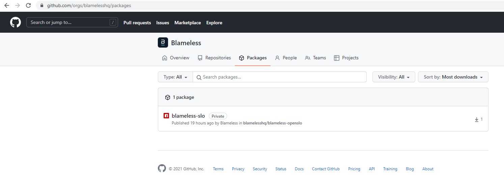
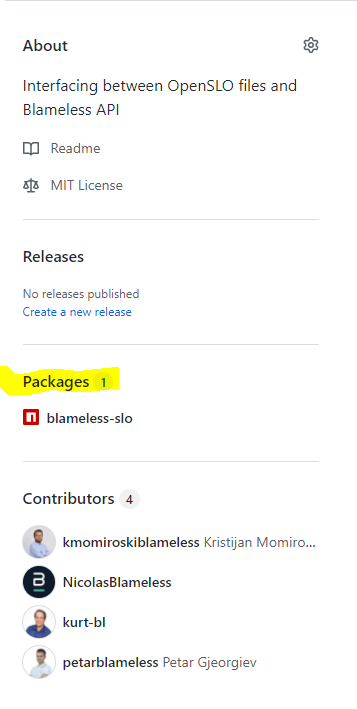

# How to find it?

Blameless SLO CLI is private npm package which is published at **Github Package Repository**. It is published at `blamelesshq` organisation. To be able to find it, you should have access to **blameless-openslo** repository. Once you confirm that you have access, there are two ways to find it.

## Find via organisation's packages

[Navigates to Github](https://github.com/orgs/blamelesshq) and navigate to **Packages** tab.

[Navigates to Github Repository](https://github.com/blamelesshq/blameless-openslo) and at right sidebar you will be able to see it under **Packages** section.

  

    <a href="describe-blameless-cli.md">< PREV: WHAT IS BLAMELESS SLO CLI?</a>

    <a href="how-to-install.md">NEXT: HOW TO INSTALL? ></a>

